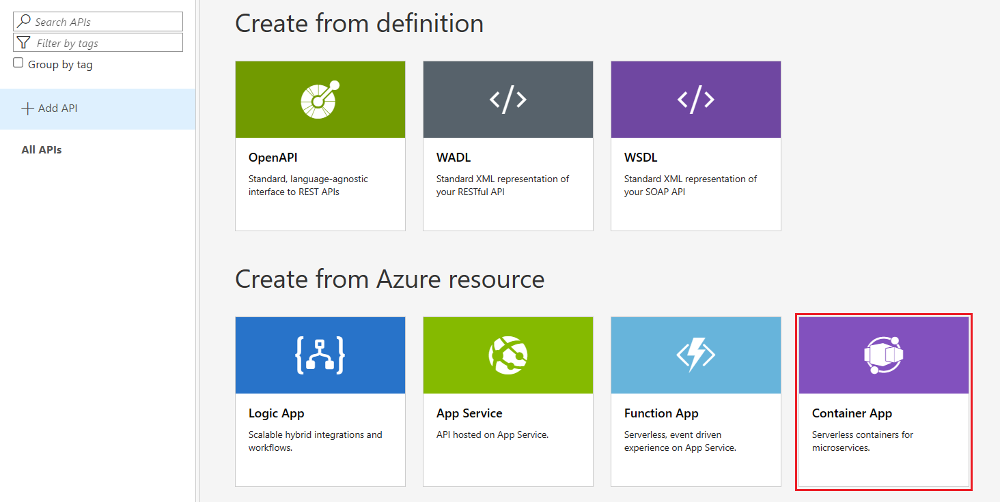
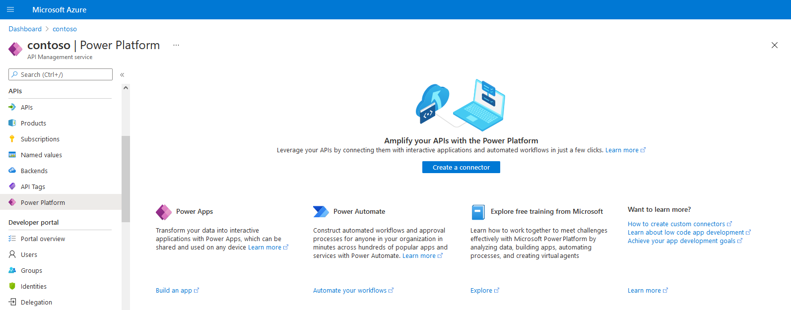
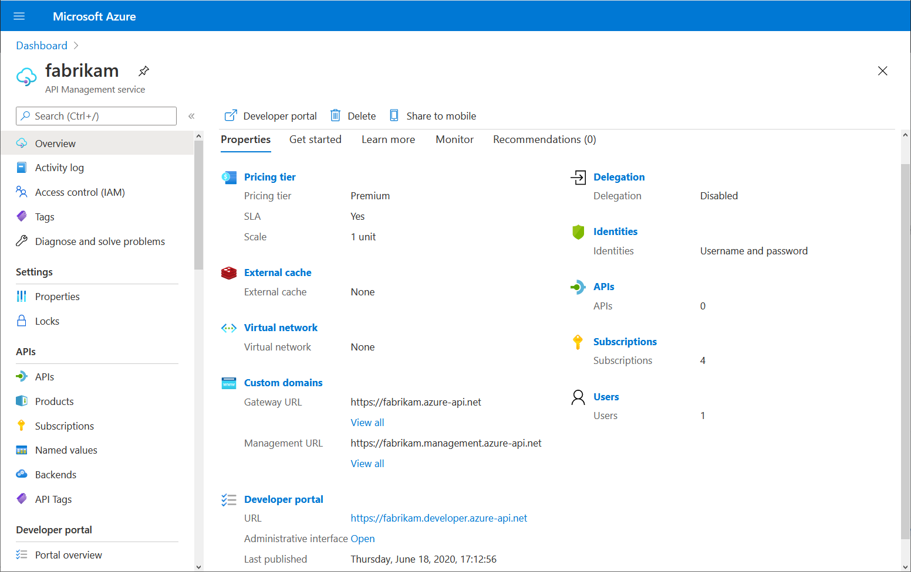
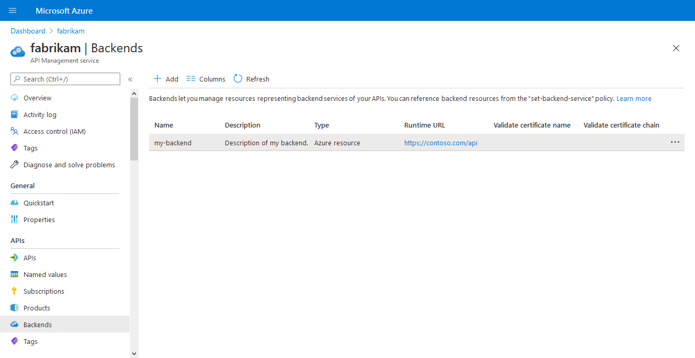

# Azure API Management service changelog

## Release - API Management service: May, 2024

### New features, improvements, and changes

- We added support for [Interface](https://spec.graphql.org/October2021/#sec-Interfaces) type to [GraphQL resolvers](https://learn.microsoft.com/azure/api-management/http-data-source-policy#resolver-for-a-graqhql-query-that-returns-a-list-using-a-liquid-template).
- Customer-managed public IP is no longer required when [deploying a service instance into a virtual network](https://learn.microsoft.com/en-us/azure/api-management/api-management-using-with-internal-vnet?tabs=stv2). Changing the subnet will remove public IP from a previously deployed service instance.

### Fixes

- We now correctly import schemas from OpenAPI 3.1 specifications.
- API imports will no longer fail because of OData specification warnings. However, errors will still cause import failures.
- Liquid template and policy expressions with XML special characters, such as "<" or ">", no longer result in runtime failures.


### Self-hosted developer portal releases

- [2.27.0](https://github.com/Azure/api-management-developer-portal/releases/tag/2.27.0)

### Self-hosted gateway container image releases

- No new releases

### Self-hosted gateway Helm chart releases

- No new releases

## Release - API Management service: March 2024

###  ‼️ Breaking changes ‼️

- On June 14, 2024, we’re introducing [breaking changes](https://learn.microsoft.com/azure/api-management/breaking-changes/workspaces-breaking-changes-june-2024) to the Workspaces feature. You may have to take action to continue using workspaces beyond June 14, 2024.

### New features, improvements, and changes

- We’ve introduced several new features and improvements to workspaces:
    - You can now create and manage certificates, backends, diagnostics, and loggers inside a workspace with the `2023-09-01-preview` management API version.Azure portal interface will be released soon.
    - You can now use `context.Workspace` in policy expressions.
    - "default-workspace" is now a reserved workspace resource name.
- We now preserve the `format` and `schema` properties of the form-data parameters when importing OpenAPI APIs.
- HTTP version information will now be included in the [request trace](https://learn.microsoft.com/azure/api-management/api-management-howto-api-inspector).
- We’ve added support for HS512 and RS512 algorithms in the [`validate-jwt`](https://learn.microsoft.com/azure/api-management/validate-jwt-policy#usage-notes) policy.
- `client-application-ids` element is now optional in [`validate-azure-ad-token`](https://learn.microsoft.com/azure/api-management/validate-azure-ad-token-policy) policy.
- We've made a couple improvements to the GraphQL support:
    - We've added support for [Union Type](https://spec.graphql.org/October2021/#sec-Unions) in GraphQL [resolvers](https://learn.microsoft.com/azure/api-management/http-data-source-policy#resolver-for-a-graqhql-query-that-returns-a-list-using-a-liquid-template)
    - Arrays can now be used within the [`set-body`](https://learn.microsoft.com/azure/api-management/set-body-policy) policy to project the [data obtained by a resolver](https://learn.microsoft.com/azure/api-management/http-data-source-policy) onto the list of primitive data types specified in the GraphQL schema
- An [Azure Advisor](https://learn.microsoft.com/azure/advisor/advisor-overview) notification will be sent to customers when they inadvertantly delete the [FQDN](https://learn.microsoft.com/azure/virtual-network/ip-services/public-ip-addresses#dns-name-label) property from the public IP resource assigned to API Management.
- We've made several improvements to the [VNet integration](https://learn.microsoft.com/azure/api-management/integrate-vnet-outbound) in the Standard v2 tier:
    - We will now detect if the prerequisites for VNet integration are not being met - i.e., [subnet delegation and service association link](https://learn.microsoft.com/azure/api-management/integrate-vnet-outbound#prerequisites), and fail the deployment faster.
    - All traffic from the VNet-integrated Standard v2 service instances to the Internet will be now routed via the integrated VNet.
    - The outbound IP will now be populated and shows its respective value.

### Fixes

- We’ve resolved the issue where Azure API Management would incorrectly log requests that were rejected due to public network access is disabled. This fix ensures that logs and metrics in Azure Monitor now exclude these rejected requests when API Management is [set up with a private endpoint](https://learn.microsoft.com/azure/api-management/private-endpoint).
- An attempt to create diagnostics in a workspace that doesn't exist will now return a `404 Not Found` error. Previously, API Management returned a `500 Internal Server Error` response.
- Workspace users can no longer override diagnostics settings defined for all APIs on the service level.
- Exporting APIs with empty or whitespace-only examples no longer produces an error.
- Optional string query parameters are no longer added to the API operation's URL template.
-`$DevPortalUrl` variable in the developer welcome email template now returns a new developer portal URL. Previously, it returned a legacy developer portal URL.
- The [`authenticate-certificate`](https://learn.microsoft.com/azure/api-management/authentication-certificate-policy) policy now performs a case-insensitive certificate ID validation. Previously, request processing would fail when the casing between the certificate ID in the policy and in the request didn’t match.
- We've fixed an issue preventing recovery of the [soft-deleted](https://learn.microsoft.com/azure/api-management/soft-delete#recover-a-soft-deleted-instance) Basic v2 and Standard v2 service instances.

### Self-hosted developer portal releases

- [2.26.0](https://github.com/Azure/api-management-developer-portal/releases/tag/2.26.0)

### Self-hosted gateway container image releases

- [2.5.0](https://github.com/Azure/api-management-self-hosted-gateway/releases/tag/Container-v2.5.0)

### Self-hosted gateway Helm chart releases

- [1.9.0](https://github.com/Azure/api-management-self-hosted-gateway/releases/tag/v1.9.0)

## Release - API Management service: February 2024

### New features, improvements, and changes

- [TLS 1.3 and related cipher suites are now supported](https://techcommunity.microsoft.com/t5/azure-integration-services-blog/announcing-the-availability-of-tls-1-3-in-azure-api-management/ba-p/4047586).
- The `validate-jwt` [policy](https://learn.microsoft.com/azure/api-management/validate-jwt-policy) now works with tokens signed PS256 signature algorithm.
- We raised the content size limit in the `validate-content` [policy](https://learn.microsoft.com/azure/api-management/validate-content-policy) to 4MB.
- A current API revision can now be addressed using a [revision-specific URL](https://learn.microsoft.com/azure/api-management/api-management-revisions#accessing-specific-revisions) in addition to the API's base URL.

### Fixes

- Self-hosted gateway using [EntraID authentication](https://learn.microsoft.com/azure/api-management/self-hosted-gateway-enable-azure-ad) to connect to the associated Azure API Management service instance are now showing heartbeats in the Azure Portal.
- We fixed the issue preventing “Scheduled Maintenance” events from being shown in the Activity log.
- The `set-body` policies contained within GraphQL resolver policies (see [example](https://learn.microsoft.com/azure/api-management/http-data-source-policy#example-policy-1)) is now executed for streamed responses.
- The issue making resolver get incorrect values from the cache for some GraphQL requests is now fixed.
- Requests resulting in a log entry larger than 32KB, previously not logged at all, are now logged to Azure Monitor after trimming.

### Developer portal releases

- No releases.

### Self-hosted gateway container image releases

•	[2.5.0](https://github.com/Azure/api-management-self-hosted-gateway/releases/tag/Container-v2.5.0)

### Self-hosted gateway Helm chart releases

•	[1.9.0](https://github.com/Azure/api-management-self-hosted-gateway/releases/tag/v1.9.0)

## Release - API Management service: December, 2023

### New features, improvements, and changes

- We reserved`default`[Workspace](https://learn.microsoft.com/azure/api-management/workspaces-overview) name for internal use. After the update, users will not be able to create Workspaces with that name.

### Fixes

- We fixed an issue causing degraded performance when creating new service instance.
- We fixed an issue with `DevPortalHost` property not being passed correctly into the email notification template.
- We eliminated inconsistency in [Security Scheme](https://spec.openapis.org/oas/v3.1.0#security-scheme-object) and [Security Requirement](https://spec.openapis.org/oas/v3.1.0#security-requirement-object) objects in OpenAPI exports when performed by authenticated vs. anonymous users.

### Developer portal releases

- No releases.

### Self-hosted gateway container image releases

- [2.4.0](https://github.com/Azure/api-management-self-hosted-gateway/releases/tag/Container-v2.4.0)
- [2.3.6](https://github.com/Azure/api-management-self-hosted-gateway/releases/tag/Container-v2.3.6)

### Self-hosted gateway Helm chart releases

- [1.8.0](https://github.com/Azure/api-management-self-hosted-gateway/releases/tag/v1.8.0)
- [1.7.6.](https://github.com/Azure/api-management-self-hosted-gateway/releases/tag/v1.7.6)

## Release - API Management service: November, 2023

### New features, improvements, and changes
 
- We will now provide specifics about token validation failures in `validate-azure-ad-token` policy in API Inspector.
- We made the password policy stronger for users creating accounts on the developer portal - e.g., it now requires using a special character. Complete password requirements will be shown on the sign-up page.
- Users now must provide their current password before changing it on the developer portal.
- Pagination controls on the developer portal now feature only the Next and Previous buttons.
 
### Fixes
 
- We fixed an issue that caused tokens of logged-out developer portal users signed in via Azure AD B2C to remain valid under some circumstances.
- We fixed a regression that caused POST requests issued from the try it console on the developer portal not to work correctly.
- We fixed an issue in the Content Access Control feature of the developer portal that allowed unauthorized access to pages via direct link.
 
### Developer portal releases
 
 - No releases.
 
### Self-hosted gateway container image releases
 
 - [2.4.0](https://github.com/Azure/api-management-self-hosted-gateway/releases/tag/Container-v2.4.0)
 - [2.3.6](https://github.com/Azure/api-management-self-hosted-gateway/releases/tag/Container-v2.3.6)
 
### Self-hosted gateway Helm chart releases

- [1.8.0](https://github.com/Azure/api-management-self-hosted-gateway/releases/tag/v1.8.0)
- [1.7.6.](https://github.com/Azure/api-management-self-hosted-gateway/releases/tag/v1.7.6)

# Release - API Management service: October 2023

### Highlights

- We're thrilled to announce the public preview launch of our latest Azure API Management pricing tiers: Basic v2 and Standard v2. ([Docs](https://learn.microsoft.com/azure/api-management/v2-service-tiers-overview))

### New features, fixes and improvements

- Minor bug fixes and improvements.

### Developer portal releases

- No releases.

### Self-hosted gateway container image releases

- [2.3.5](https://github.com/Azure/api-management-self-hosted-gateway/releases/tag/Container-v2.3.5)

### Self-hosted gateway Helm chart releases

- [1.7.5](https://github.com/Azure/api-management-self-hosted-gateway/releases/tag/v1.7.5)

## Release - API Management service: September 2023

### New features, fixes, and improvements

1. We have introduced new Azure Advisor recommendations:
    - Use Azure AD authentication instead of gateway token for Configuration API
    - Identity self-hosted gateways using gateway tokens that will expire in < 7 days
    - Identity validate-jwt policy usage with insecure key size   
2. We have removed support for the [retired set-graphql-resolver policy](https://learn.microsoft.com/en-us/azure/api-management/set-graphql-resolver-policy) which had already been replaced with GraphQL API resolvers.
3. We have fixed an issue where the OpenAPI would fail if the parameter names where empty.
4. We have fixed an issue where nested objects were being overridden when import OpenAPI was used.
5. We have fixed an issue where the FixOpenApi parameter schema can now import complex schemas.
6. We have fixed a bug where validate-azure-token policy was not properly using expressions to resolve tenant-id.
7. We have fixed an issue where deleting the API release will now return 204 instead of 404 if release does not exist.
8. We have fixed an issue where the Deletion of API was not removing all of the releases. When deleting an API it will now delete all of its releases.
9. We have fixed an issue where the DELETE operation for API endpoint was synchronous and timing out. The DELETE operation has been made asynchronous to fix this issue.

### Self-hosted gateway container image releases

1. [2.3.4](https://github.com/Azure/api-management-self-hosted-gateway/releases/tag/Container-v2.3.4)
2. [2.3.3](https://github.com/Azure/api-management-self-hosted-gateway/releases/tag/Container-v2.3.3)
3. [2.3.2](https://github.com/Azure/api-management-self-hosted-gateway/releases/tag/Container-v2.3.2)
4. [2.3.1](https://github.com/Azure/api-management-self-hosted-gateway/releases/tag/Container-v2.3.1)
5. [2.3.0](https://github.com/Azure/api-management-self-hosted-gateway/releases/tag/Container-v2.3.0)

### Self-hosted gateway Helm chart releases

1. [1.7.4](https://github.com/Azure/api-management-self-hosted-gateway/releases/tag/v1.7.4)
2. [1.7.3](https://github.com/Azure/api-management-self-hosted-gateway/releases/tag/v1.7.3)
3. [1.7.2](https://github.com/Azure/api-management-self-hosted-gateway/releases/tag/v1.7.2)
4. [1.7.1](https://github.com/Azure/api-management-self-hosted-gateway/releases/tag/v1.7.1)
5. [1.7.0](https://github.com/Azure/api-management-self-hosted-gateway/releases/tag/v1.7.0)

## Release - API Management service: April 2023

### Highlights

1. [Azure API Management and Microsoft Defender for APIs integration is now in preview](https://azure.microsoft.com/updates/public-preview-azure-api-management-and-microsoft-defender-for-apis-integration/). [Learn how Microsoft bolsters cloud-native security in Defender for Cloud with new API security capabilities](https://aka.ms/DfAPIlaunch).
2. [Workspaces in Azure API Management are now in preview](https://azure.microsoft.com/updates/public-preview-workspaces-in-azure-api-management/).
3. [Synthetic GraphQL is now generally available](https://azure.microsoft.com/updates/generally-available-synthetic-graphql-2/).
4. [Authorizations in Azure API Management are now generally available](https://azure.microsoft.com/updates/generally-available-api-management-authorizations/).
5. [Incoming traffic to Azure API Management's gateway can be secured to clients running in a virtual network through Azure Private Link](https://azure.microsoft.com/updates/generally-available-azure-private-link-support-in-azure-api-management/).

### New features, fixes, and improvements

1. We fixed an issue, where the customers potentially could not change organization or email in the email notifications.

### Developer portal releases

1. [2.23.0](https://github.com/Azure/api-management-developer-portal/releases/tag/2.23.0)

### Self-hosted gateway container image releases

1. [2.2.0](https://github.com/Azure/api-management-self-hosted-gateway/releases/tag/Container-v2.2.0)

### Self-hosted gateway Helm chart releases

1. [1.6.0](https://github.com/Azure/api-management-self-hosted-gateway/releases/tag/v1.6.0)

## Release - API Management service: February & March 2023

A regular Azure API Management service update was started February 9, 2023. This release concluded rollout on March 31, 2023.

### New features, fixes, and improvements

1. We added the new `context.Deployment.Gateway.*` object with several properties for accessing gateway information in runtime policies. [Learn more](https://learn.microsoft.com/azure/api-management/api-management-policy-expressions#ContextVariables).
2. We fixed an issue, where the definition names in the API schema would display blank spaces.
3. We fixed an issue, where the developer portal was hiding default domain, a parameter has been added to include default domain in the hostnames.
4. We fixed an issue, where the API revisions were not being properly filtered.
5. We fixed an issue, where adding API schemas with the same namespace resulted in an error.
6. We fixed an issue, where policies contained all named values which caused a problem for secrets. The policy failed to check if given user had access to secret.
7. We fixed an issue, whereby Azure Active Directory v1 tokens could be validated with `validate-azure-ad-token` policy, but v2 tokens could not be validated. With this release, both v1 and v2 tokens are supported.
8. Previously, `validate-azure-ad-token` would only validate tokens against the public cloud instance of Azure Active Directory (AD). With this release, token validation is supported in every Azure cloud where Azure Active Directory is available.
9. Previously, the gateway would not refresh the GraphQL schema when it was updated from the Azure portal. The gateway now correctly refreshes the GraphQL schema after it's updated in the Azure portal.
10. We implemented a GraphQL context variable to allow access to all portions of the GraphQL context within policy expressions. 

### Self-hosted gateway container image release
1. [2.2.0](https://github.com/Azure/api-management-self-hosted-gateway/releases/tag/Container-v2.2.0-preview-1) (Preview 1)
2. [2.1.8](https://github.com/Azure/api-management-self-hosted-gateway/releases/tag/Container-v2.1.8)
3. [2.1.7](https://github.com/Azure/api-management-self-hosted-gateway/releases/tag/Container-v2.1.7)
### Self-hosted gateway Helm chart
1. [1.5.5](https://github.com/Azure/api-management-self-hosted-gateway/releases/tag/v1.5.5)
2. [1.5.4](https://github.com/Azure/api-management-self-hosted-gateway/releases/tag/v1.5.4)
3. [1.5.3](https://github.com/Azure/api-management-self-hosted-gateway/releases/tag/v1.5.3)
4. [1.5.2](https://github.com/Azure/api-management-self-hosted-gateway/releases/tag/v1.5.2)

## Release - API Management service: December 2022

A regular Azure API Management service update was started on December 8, 2022. This release will continue to roll out through January 2023.

### New features, fixes, and improvements

1. The `log-to-eventhub` policy now supports securing connections to Azure Event Hub with managed identity.
2. We fixed an issue, where the GraphQL in API Management will no longer fail when an introspection query is added to the synthetic GraphQL resolver policy.
3. We fixed an issue, where saving some policy fragments in Consumption tier services was failing.
4. We fixed an issue, where modifying a policy using client SDKs or PowerShell was failing with a 406 Not Acceptable response. The issue was caused by the management API's failure to handle PUT requests with the wildcard (`*/*`) `Accept` header.

### Developer portal releases

1. [2.22.0](https://github.com/Azure/api-management-developer-portal/releases/tag/2.22.0)

## Release - API Management service: October, 2022

A regular Azure API Management service update was started on October 31, 2022. It may take several weeks for your API Management service to receive the update.

### Feature retirements

1. [Support for Azure API Management self-hosted gateway version 0 and version 1 ends 1 October 2023](https://azure.microsoft.com/updates/support-for-azure-api-management-selfhosted-gateway-version-0-and-version-1-ends-1-october-2023/).

### New features, fixes, and improvements

1. You can now easily validate Azure Active Directory tokens on incoming requests with the new `validate-azure-ad-token` policy. Learn more in the [documentation](https://learn.microsoft.com/azure/api-management/api-management-access-restriction-policies#ValidateAAD) or [blog post](https://techcommunity.microsoft.com/t5/azure-developer-community-blog/introducing-a-better-way-to-integrate-azure-ad-with-api/ba-p/3671864).
2. We fixed an issue, where API Management didn't allow clients to open new WebSocket connections even though they didn't exceed the connections limit.
3. API Management updates are now rolled out to one Availability Zone at a time. Previously, updates were rolled out to multiple Availability Zones, reducing the service capacity by up to 50%.
4. You can now use `cors` and caching policies (`cache-store` and `cache-lookup`) inside policy fragments. Previously the `cors` policy inside policy fragments didn't correctly apply CORS configuration to the API; caching policies couldn't be configured due to an error.
5. API Management scale-out attempts that fail due to insufficient subnet capacity are now properly logged in Activity Logs.
6. XML schema validation with `validate-content` policy no longer results in validation errors for elements with type "anyType".
7. The execution time of the `send-one-way-request` policy is no longer included in the `backendTime` metric in the diagnostic logs, since it's an asynchronous, non-blocking operation. Previously, it was included in the `backendTime` metric but excluded from the `totalTime` metric.

### Developer portal releases

1. [2.21.0](https://github.com/Azure/api-management-developer-portal/releases/tag/2.21.0)
2. [2.20.0](https://github.com/Azure/api-management-developer-portal/releases/tag/2.20.0)
3. [2.19.1](https://github.com/Azure/api-management-developer-portal/releases/tag/2.19.1)

### Self-hosted gateway container image releases

1. [2.1.6](https://github.com/Azure/api-management-self-hosted-gateway/releases/tag/Container-v2.1.6)
2. [2.1.5](https://github.com/Azure/api-management-self-hosted-gateway/releases/tag/Container-v2.1.5)

### Self-hosted gateway Helm chart releases

1. [1.5.1](https://github.com/Azure/api-management-self-hosted-gateway/releases/tag/v1.5.1)
2. [1.5.0](https://github.com/Azure/api-management-self-hosted-gateway/releases/tag/v1.5.0)

## Release - API Management service: September, 2022

A regular Azure API Management service update was started on September 7, 2022. It may take several weeks for your API Management service to receive the update.

### Highlights

1. [Custom widget support in managed developer portal is now generally available](https://azure.microsoft.com/generally-available-api-management-custom-widget-support-in-developer-portal/).
2. [Expanded support for Azure Policy definitions for Azure API Management is now generally available](https://azure.microsoft.com/updates/generally-available-azure-api-management-expanded-support-for-azure-policy-definitions/).
3. [Support for OAuth 2.0 authorization code flow using PKCE for developer portal user sign-in and sign-up is now generally available](https://azure.microsoft.com/updates/generally-available-azure-api-management-support-for-msal-in-developer-portal/).

### New features, fixes, and improvements

1. The new `allow-additional-properties` attribute of the `validate-content` policy lets you implement a runtime override of the `additionalProperties` value configured in the JSON schemas - for example, to always prevent requests or responses with undefined schema properties, regardless of the JSON configuration. Documentation will be released soon in the [`validate-content` policy reference](https://docs.microsoft.com/azure/api-management/validation-policies).
2. Account confirmation links in the account registration email notifications sent to developer portal users no longer include user ID and identity in the URL.
3. We fixed an issue, where request and response validation policies would skip the `on-error` policy section if multiple validations failed.
4. Azure API Management no longer depends on the SMTP endpoints for sending email notifications and those endpoints can now be removed from the VNet configuration for allowed network traffic.
5. We optimized performance of synthetic GraphQL APIs resolving multiple fields from the same endpoint.
6. We fixed an issue, where using the developer portal test console configured with authorization code grant flow and OpenID Connect resulted in an error.
7. We fixed an issue, where several properties in the "[APIs - List By Service](https://docs.microsoft.com/rest/api/apimanagement/current-ga/apis/list-by-service?tabs=HTTP)" management API response weren't propagated with values. The contract now follows the documented schema.
8. We fixed an issue where an invalid request to create an [API Schema](https://docs.microsoft.com/rest/api/apimanagement/current-ga/api-schema/create-or-update?tabs=HTTP) could result in an `500 Internal Server Error` response. API Management now returns `400 Bad Request` in such cases.
9. We fixed an issue, where an unsuccessful management operation on a policy fragment could result in failure of future management operations on that policy fragment.
10. We fixed an issue, where built-in git repository export could fail.

### Developer portal releases

1. [2.19.0](https://github.com/Azure/api-management-developer-portal/releases/tag/2.19.0)
2. [2.18.2](https://github.com/Azure/api-management-developer-portal/releases/tag/2.18.2)

### Self-hosted gateway container image releases

1. [2.1.4](https://github.com/Azure/api-management-self-hosted-gateway/releases/tag/Container-v2.1.4)

### Self-hosted gateway Helm chart releases

1. [1.4.1](https://github.com/Azure/api-management-self-hosted-gateway/releases/tag/v1.4.1)

### DevOps Resource Kit releases

1. [1.0.0 (general availability)](https://github.com/Azure/azure-api-management-devops-resource-kit/releases/tag/1.0.0)
2. [1.0.0-beta.11](https://github.com/Azure/azure-api-management-devops-resource-kit/releases/tag/1.0.0-beta.11)
3. [1.0.0-beta.10](https://github.com/Azure/azure-api-management-devops-resource-kit/releases/tag/1.0.0-beta.10)
4. [1.0.0-beta.9](https://github.com/Azure/azure-api-management-devops-resource-kit/releases/tag/1.0.0-beta.9)
5. [1.0.0-beta.8](https://github.com/Azure/azure-api-management-devops-resource-kit/releases/tag/1.0.0-beta.8)

## Release - API Management service: July, 2022

A regular Azure API Management service update was started on July 20, 2022. It may take several weeks for your API Management service to receive the update.

### New features, fixes, and improvements

1. We optimized the loading time of API schemas for management plane (including Azure portal) and developer portal operations.
2. We increased the maximum length of each URL path segment from 520 to 1024 characters.
3. We fixed an issue, where API Management allowed creation of multiple API versions with empty identifiers within one API version set.
4. We fixed an issue, where API Management deserialized C-style hex strings in exported OpenAPI files as hex values.
5. We fixed an issue, where API Management failed to export OpenAPI definitions if referenced schemas didn't have the `typename` property defined.
6. The `set-body` policy now supports `xsi-nil` attribute with two values (`"blank"` and `"null"`) for controlling how elements marked with `xsi:nil="true"` are represented in XML payloads. If the value is set to `blank`, API Management uses the prior behavior, where nil is represented as an empty string. If the value is set to `null`, nil is represented with a null value.
7. You can now monitor inbound connectivity to the API Management control plane in the "Network status" tab of the "Network" page in the Azure portal interface for your API Management service.
8. [Authorizations](https://docs.microsoft.com/azure/api-management/authorizations-overview) now support Salesforce, ServiceNow, Twitter, Stripe, and Zendesk identity providers.
9. Authorizations now support PKCE authorization flow in the generic OAuth2 identity provider.
10. Improvements to the GraphQL support:
    1. API Management now supports GraphQL requests with the content type `application/graphql`. Previously, such requests resulted in a `400 Bad request` error.
    2. GraphQL resolvers can now be configured in policy fragments for reuse in the `backend` policy section.
    3. We fixed an issue, where creating a new GraphQL API using the property `format: graphql-format` resulted in failures in execution of the management API operations or ARM templates. This property worked only for existing GraphQL APIs.
    4. We fixed an issue, where accessing `context.Request` in a synthetic GraphQL API's `set-graphql-resolver` policy would overwrite the `context.Request` value.
    5. We fixed an issue, where parsing of lists with scalar values resulted in runtime errors.

### Developer portal releases

1. [2.18.1](https://github.com/Azure/api-management-developer-portal/releases/tag/2.18.1)
2. [2.18.0](https://github.com/Azure/api-management-developer-portal/releases/tag/2.18.0)

### Self-hosted gateway container image releases

1. [2.1.3](https://github.com/Azure/api-management-self-hosted-gateway/releases/tag/Container-v2.1.3)
2. [2.1.2](https://github.com/Azure/api-management-self-hosted-gateway/releases/tag/Container-v2.1.2)
3. [2.1.1](https://github.com/Azure/api-management-self-hosted-gateway/releases/tag/Container-v2.1.1)
4. [2.0.4](https://github.com/Azure/api-management-self-hosted-gateway/releases/tag/Container-v2.0.4)

Browse the recently added release notes for older images:

1. [2.1.0](https://github.com/Azure/api-management-self-hosted-gateway/releases/tag/Container-v2.1.0)
2. [2.0.3](https://github.com/Azure/api-management-self-hosted-gateway/releases/tag/Container-v2.0.3)
3. [2.0.2](https://github.com/Azure/api-management-self-hosted-gateway/releases/tag/Container-v2.0.2)
4. [2.0.1](https://github.com/Azure/api-management-self-hosted-gateway/releases/tag/Container-v2.0.1)
5. [2.0.0](https://github.com/Azure/api-management-self-hosted-gateway/releases/tag/Container-v2.0.0)

### Self-hosted gateway Helm chart releases

1. [1.4.0](https://github.com/Azure/api-management-self-hosted-gateway/releases/tag/v1.4.0)
2. [1.3.1](https://github.com/Azure/api-management-self-hosted-gateway/releases/tag/v1.3.1)
3. [1.3.0](https://github.com/Azure/api-management-self-hosted-gateway/releases/tag/v1.3.0)

### DevOps Resource Kit releases

1. [1.0.0-beta.8](https://github.com/Azure/azure-api-management-devops-resource-kit/releases/tag/1.0.0-beta.8)
2. [1.0.0-beta.7](https://github.com/Azure/azure-api-management-devops-resource-kit/releases/tag/1.0.0-beta.7)

## Release - API Management service: June, 2022

A regular Azure API Management service update was started on June 20, 2022. It may take several weeks for your API Management service to receive the update.

### Highlights

1. [GraphQL passthrough support is now generally available](https://azure.microsoft.com/updates/general-availability-graphql-passthrough-support-in-azure-api-management/)
2. [Synthetic GraphQL is now in public preview](https://azure.microsoft.com/updates/public-preview-synthetic-graphql/)
3. [Authorizations are now in public preview](https://azure.microsoft.com/updates/public-preview-api-management-authorizations/)
4. [Self-hosted gateway v2 is now generally available](https://azure.microsoft.com/updates/generally-available-api-management-selfhosted-gateway-version-2/)
5. [Reusable policy fragments are now generally available](https://azure.microsoft.com/updates/generally-available-api-management-reusable-policy-fragments/)
6. [Developer portal's support for Content Security Policy and self-hosted portal CORS configuration are now generally available](https://azure.microsoft.com/updates/generally-available-api-management-content-security-policy-and-cors-configuration-support/)
7. [Learn how to prevent or mitigate OWASP API Security Top 10 threats in Azure API Management](https://aka.ms/apimdocs/security/owasp)

### New features, fixes, and improvements

1. Email notifications now have valid SPF and DKIM signatures. Previously, the generated DKIM signatures were invalid.
2. `System.Net.IpAddress` and `System.Enum` namespaces are now allowed in policy expressions.
3. Scale-up operations will now fail faster if there isn't enough space in a virtual network subnet to accommodate additional API Management service units. The error will be included in the Activity Logs.
4. We fixed an issue, where scale-up operations could get stuck for multiple days in `stv1` deployments. As a precaution against other potential problems with the `stv1` architecture, we recommend migrating services to the `stv2` architecture. [Learn more about the migration process](https://docs.microsoft.com/azure/api-management/compute-infrastructure#how-do-i-migrate-to-the-stv2-platform).
5. We fixed an issue, where WebSocket connections couldn't be established for requests with multiple `Connection` headers.
6. Management API SAS token can no longer be generated with an expiration date set in the past.
7. "Dapr" is now a reserved backend entity ID.

### Developer portal releases

1. [2.17.0](https://github.com/Azure/api-management-developer-portal/releases/tag/2.17.0)

### Self-hosted gateway Helm releases

1. [1.2.0](https://github.com/Azure/api-management-self-hosted-gateway/releases/tag/v1.2.0)

### DevOps Resource Kit releases

1. [1.0.0-beta.6](https://github.com/Azure/azure-api-management-devops-resource-kit/releases/tag/1.0.0-beta.6)
2. [1.0.0-beta.5](https://github.com/Azure/azure-api-management-devops-resource-kit/releases/tag/1.0.0-beta.5)

## Release - API Management service: May, 2022

A regular Azure API Management service update was started on May 10, 2022. It may take several weeks for your API Management service to receive the update.

### New features, fixes, and improvements

1. GraphQL support now includes [policy-based authorizations](https://docs.microsoft.com/azure/api-management/graphql-validation-policies), `graphql-ws`-based subscriptions, and improved developer portal and Azure portal interfaces.
2. Availability zone deployments are now available in the Switzerland North region.
3. You can now access the API Management service name in runtime policies with the new `context.Deployment.ServiceId` property. The `ServiceId` property is also included in Application Insights logs.
4. `validate-parameters` and `validate-content` policies now support GUID properties defined as `format: uuid`.
5. Event Hub loggers can now use managed identity authentication. Azure portal interface for configuring this authentication is coming soon.

### Changes

1. Values of the `server name` property in Application Insights live metrics no longer include the `.azure-api.net` suffix.
2. The value of `ServiceName` property in API inspector JSON no longer includes the `.azure-api.net` suffix.

### Developer portal releases

1. [2.16.0](https://github.com/Azure/api-management-developer-portal/releases/tag/2.16.0) - highlights:
   * Improvements to API reference pages and test console.
   * Support for GraphQL subscriptions.
2. [2.15.1](https://github.com/Azure/api-management-developer-portal/releases/tag/2.15.1) - highlights:
   * Includes a fix for a regression in the API list dropdown widget introduced in version 2.15.0.
3. [2.15.0](https://github.com/Azure/api-management-developer-portal/releases/tag/2.15.0) - highlights:
   * The authorization server information has been temporarily removed from the API details widget, until a more complete solution is in place.
   * Terms of use are now included in the authentication pages.

### Self-hosted gateway Helm releases

1. [1.1.0](https://github.com/Azure/api-management-self-hosted-gateway/releases/tag/v1.1.0)

### DevOps Resource Kit releases

1. [1.0.0-beta.4](https://github.com/Azure/azure-api-management-devops-resource-kit/releases/tag/1.0.0-beta.4)
2. [1.0.0-beta.3](https://github.com/Azure/azure-api-management-devops-resource-kit/releases/tag/1.0.0-beta.3)
3. [1.0.0-beta.2](https://github.com/Azure/azure-api-management-devops-resource-kit/releases/tag/1.0.0-beta.2)

## Release - API Management service: March, 2022

A regular Azure API Management service update was started on March 28, 2022. It may take several weeks for your API Management service to receive the update.

**Starting with this service release, we will be posting regular release announcements only here, on GitHub, and we will not be posting them on [Azure Updates](https://aka.ms/apimupdates). We will continue to post feature or breaking change announcements on Azure Updates and reference them in regular release notes on GitHub.**

### Featured

1. [SOAP and XML request and response validation is now generally available](https://azure.microsoft.com/updates/general-availability-soap-and-xml-request-and-response-validation/).
2. [Developer portal widget for embedding custom HTML code is now generally available](https://azure.microsoft.com/updates/general-availability-developer-portal-widget-for-embedding-custom-html-code/).
3. [Azure Private Link support in Azure API Management is now in public preview](https://azure.microsoft.com/updates/public-preview-azure-private-link-support-in-azure-api-management-2/).
4. [Tools for easier import of WSDL APIs and XSD and JSON schemas are now available on GitHub](https://github.com/Azure-Samples/api-management-schema-import).

### Breaking change advisory

1. [Review your virtual network configuration - it may be affected by IP address changes in March 2023](https://azure.microsoft.com/updates/ip-address-changes-will-begin-affecting-your-ability-to-manage-your-virtual-networkenabled-api-management-services-on-31-marc/).

### Fixes and improvements

1. To protect services from username enumeration attacks, any attempt to reset user's password now results in a successful response from the API Management service. Previously, API Management returned `404 Not Found` if the username didn't exist in the service.
2. Users no longer can subscribe to products that they don't have access to. Previously, product access configuration only restricted retrieval of product details and its APIs and it didn't prevent subscription attempts.
3. If a policy expression contains a loop and takes over five seconds to execute, API Management will now terminate its execution to avoid infinite loops.
4. You can now reference JSON schema resources from another JSON schema resource. The new [schema entity](https://docs.microsoft.com/rest/api/apimanagement/current-ga/global-schema) is used for [request or response validation](https://docs.microsoft.com/azure/api-management/validation-policies#schemas-for-content-validation).
5. Null values are no longer accepted inside the `certificateIds` array when creating or updating backend entities.
6. Client disconnects from gateway are no longer reported as errors.
7. `X-Forwarded-For` header logs now include addresses added by the gateway.
8. Severity level is now correctly configured in Application Insights traces. Previously, `verbose` and `information` traces were logged to Application Insights with higher severity.
9. GraphQL request processing is now faster and more efficient thanks to a series of optimizations.

### Developer portal releases

1. [2.14.0](https://github.com/Azure/api-management-developer-portal/releases/tag/2.14.0) - highlights:
   * Support for `contact`, `license`, and `termsOfService` OpenAPI properties in the API reference pages.
   * Improvements to GraphQL API reference pages, including the _code view_.
2. [2.13.0](https://github.com/Azure/api-management-developer-portal/releases/tag/2.13.0) - highlights:
    * HTML injection widget, which allows you to render custom HTML code in an iframe in your managed or self-hosted developer portal pages.
    * Revised code samples in the test console and a new code sample for Swift.

### DevOps Resource Kit releases

1. [1.0.0-beta.1](https://github.com/Azure/azure-api-management-devops-resource-kit/releases/tag/1.0.0-beta.1):
    * Major code refactoring to the Extractor to make it more maintainable and easier to contribute to.
    * Update of the API version used in the Extractor to the latest generally available version (`2021-08-01`).
    * Other fixes, improvements, and community contributions.

## Release - API Management service: January, 2022

A regular Azure API Management service update was started on January 20, 2022, and included the following new features, bug fixes, and other improvements. It may take several weeks for your API Management service to receive the update.

### Featured

1. [Managed certificate support is now in public preview](https://azure.microsoft.com/updates/public-preview-managed-certificate-support-for-azure-api-management/).

### New

1. Published developer portals are now automatically upgraded to new portal releases, without the need to republish the portal manually. Automated upgrades will preserve the latest published content; they won't publish saved but unpublished content.
2. You can now use curly brackets in a SOAP action URL template (for example, `/soapAction={wildcard}`) to define a wildcard SOAP action, which will match any SOAP request that doesn't have a dedicated action defined in the API. The value inside the curly brackets doesn't affect the execution.
3. Availability zones are now supported in the East Asia region.
4. New .NET SDK for the management API [is now available in preview](https://www.nuget.org/packages/Microsoft.Azure.Management.ApiManagement/8.0.0-preview).

### Fixed

1. Newly created diagnostic settings will no longer be configured to log request query parameters by default. As part of this change, [`Diagnostic` entity](https://docs.microsoft.com/rest/api/apimanagement/current-ga/diagnostic/create-or-update#datamasking)'s `dataMasking.queryParams` properties will be set with the following wildcard configuration `{ "value": "*", "mode": "Hide"}`. The same wildcard configuration can also be applied to `dataMasking.headers`.
2. Self-hosted gateway now properly handles a certificate change (`certificateId`) for existing hostnames.
3. Multiple `validate-content` policies can now be specified in a single policy section.
4. It is now possible to delete a resource group with an `stv2`-based API Management service in a virtual network. Previously, the deletion could fail due to an unreleased public IP resource. [Learn more about `stv2` and API Management's infrastructure](https://docs.microsoft.com/azure/api-management/compute-infrastructure#compute-platform-versions).
5. `ConfigurationChange` event is no longer logged in [Resource Health](https://docs.microsoft.com/azure/service-health/resource-health-overview) for API Management service backups.
6. `tracestate` header values are no longer truncated after the first key-value pair.
7. An attempt to deploy an `stv2` API Management service into a virtual network subnet with an `stv1` API Management service will now result in a descriptive error message.

## Release - API Management service: October, 2021

A regular Azure API Management service update was started on October 25, 2021, and included the following new features, bug fixes, and other improvements. It may take several weeks for your API Management service to receive the update.

### Featured

1. [Public preview: GraphQL passthrough support in Azure API Management](https://azure.microsoft.com/updates/public-preview-graphql-passthrough-support-in-azure-api-management/).
2. [General availability: Native support for WebSocket APIs](https://azure.microsoft.com/updates/general-availability-native-support-for-websocket-apis/).
3. [General availability: API Management and Event Grid Integration](https://azure.microsoft.com/updates/general-availability-api-management-event-grid-integration/).

### New

1. You can now import [Azure Container App](https://azure.microsoft.com/services/container-apps/) as an API in API Management.
   
2. API Management now supports [managed identity authentication for communication with Application Insights](https://docs.microsoft.com/azure/azure-monitor/app/azure-ad-authentication). To configure it, specify the `identityClientId` key in the `properties.credentials` property of the `Logger` object and set the value to:
    * `systemAssigned` for a system-assigned identity, or
    * ID of a user-assigned identity.
3. Support for the multi-dimensional `Request` metric in Azure Monitor is now generally available.

### Fixed

1. We fixed an [issue](https://github.com/Azure/api-management-developer-portal/issues/1354), where the `Portal Revision` API marked all new developer portal revisions as current, regardless of the `isCurrent` parameter's value.
2. We fixed an issue, where the `specified-parameter-action` attribute of the `validate-parameters` policy was ignored.
3. Scale-outs of API Management services in the [single-tenant v2 (`stv2`) infrastructure](https://docs.microsoft.com/azure/api-management/compute-infrastructure#compute-platform-versions) no longer affect existing service capacity. Previously, each scale-out forced a restart of the existing nodes. This optimization has already been implemented in services in the `stv1` infrastructure and those services aren't affected by the change.
4. All header's schema properties are now preserved when importing an OpenAPI v3 document. Schemas for headers are supported in management API versions `2021-01-01-preview` or later.
5. Properties with `format: date` in OpenAPI documents are no longer converted to a date-time object.
6. Unknown countries are now reported as `Unknown` in the built-in API reports (*Analytics* tab in the Azure portal).
7. WebSocket APIs now support backend service URI with the WebSocket schema and a custom port.

### Information

1. Services deployed in a virtual network with forced tunneling need to allow an [additional dependency for Windows activations](https://docs.microsoft.com/troubleshoot/azure/virtual-machines/custom-routes-enable-kms-activation). Although this requirement wasn't documented, it is not introduced by the current release.

## Release - API Management service: August, 2021

A regular Azure API Management service update was started on August 19, 2021, and included the following new features, bug fixes, and other improvements. It may take several weeks for your API Management service to receive the update.

### Featured

1. [API Management's integration with Event Grid is now in preview](https://azure.microsoft.com/updates/public-preview-api-management-and-event-grid-integration/).

### New

1. [The availability zones feature](https://aka.ms/apimaz) is now supported in four new regions: South Africa North, Germany West Central, Korea Central, Norway East.
2. The `rate-limit-by-key` policy now supports policy expressions in the `calls` and `renewal-period` attributes. The `renewal-period`'s upper limit of 5 minutes still applies.
3. The upper limit of the `max-size` attribute of the `validate-content` policy can now be increased beyond 100kB through Azure support.
4. API inspector's traces now include the service name property.
5. API Management is now more responsive to moves and cluster scale-outs of Service Fabric backends.
6. API Management now supports custom domain certificates encrypted with the `AES256_SHA256` algorithm.
7. The `Network Status` management API response and page in the Azure portal now include details about the connectivity to Azure Application Insights for services with configured Application Insights loggers.
8. The "Publish" button on the "Developer portal overview" page of API Management services in the Azure portal now uses the new `Portal revisions` API, which makes it easier to publish the portal for virtual-network-injected services.
9. Clicking on a grid's row in the "Subscriptions" page of Azure API Management services in the Azure portal now brings up a new subscription editing interface.

### Fixed

1. We fixed an issue, which could cause schema definitions to be omitted while importing APIs from OpenAPI files.
2. We fixed a paging issue for API calls for retrieving the list of APIs from the developer portal.
3. The `PublisherEmail` service property now supports email addresses with the `#` character.

### Changed

1. ~~The runtime `context.Deployment.ServiceName` property and the `Service Name` attribute in Azure Application Insights logs no longer include the default hostname suffix `.azure-api.net` for API Management services in the Developer, Basic, Standard, and Premium tiers.~~ This change has been reverted.
2. Consumption tier services now allow request URLs up to 16384 characters long.
3. All responses with status code lower than `400` are now considered successful in the built-in Analytics, metrics, Azure Monitor logs, and Azure Application Insights telemetry.
4. The API gateway can no longer be disabled if the API Management service is in an internal virtual network.

## Release - API Management service: July, 2021

A regular Azure API Management service update was started on July 5, 2021, and included the following new features, bug fixes, and other improvements. It may take several weeks for your API Management service to receive the update.

### Featured

1. [Native support for WebSocket APIs is now in preview](https://azure.microsoft.com/updates/public-preview-native-support-for-websocket-apis-in-azure-api-management/).
2. [The cost of additional units in the Premium tier services has been reduced](https://azure.microsoft.com/updates/azure-api-management-premium-tier-price-reduction-for-incremental-purchased-units/).

### New

1. You can now emit custom metrics to Azure Application Insights with the new `emit-metric` policy. [Learn more](https://docs.microsoft.com/azure/api-management/api-management-advanced-policies#emit-metric).
2. Policy expressions now support `System.Net.IPAddress`.
3. The policy expressions' `context` object now includes the `context.Deployment.GatewayId` property. For managed gateways, its value is `managed`.
4. You can now export your APIs for consumption in the Power Platform through the dedicated Power Platform page in the Azure portal.
   

### Fixed

1. We fixed an issue, which caused Developer tier services in a virtual network to not emit resource health events.
2. The validation policies now correctly return:
   * Responses with the status code `400 Bad Request` and a precise error description in case of the schema mismatch for errors detected in the incoming requests.
   * Responses with the status code `502 Bad Gateway` and a generic message in the body for errors detected in the outgoing responses, to not leak API implementation details.
3. We fixed an issue, where the validation policies ignored the `nullable` property of JSON schemas.
4. We fixed an issue, where the validate content policy didn't fail the validation for empty bodies.
5. We fixed an issue, where the validation policies modified the format of the JSON payload's properties resembling datetime strings.
6. We fixed an issue, where a character sequence `@*` prevented the policy XML document from being saved.
7. We fixed an issue, where responses with an empty payload and the `Transfer-Encoding: chunked` header were incorrectly classified as completed and the response latency was miscalculated.
8. We fixed an issue, where successful API requests were marked as non-successful in the Azure Monitor and Azure Application Insights logs if the client disconnected right after receiving the response.
9. We fixed an issue, which caused the API gateway endpoint of Consumption services to remain unavailable for a few seconds after the service activation.

### Changed

1. Validation policies' `error-variable-name` attribute is now optional.
2. The `firstName` and `lastName` properties of the `User` entity no longer accept special characters (for example, `<`, `>`, `:`, `;`, `(`, `)`, `\`, `/`, `@`, `!`, and more).

## Release - API Management service: May, 2021

A regular Azure API Management service update was started on May 5, 2021, and included the following new features, bug fixes, and other improvements. It may take several weeks for your API Management service to receive the update.

### Featured

1. [Open-source API Portal is now generally available](https://azure.microsoft.com/updates/apiportal/).
2. [Azure API Management's support for Availability Zones is now generally available](https://azure.microsoft.com/updates/azure-api-management-support-for-availability-zones-now-generally-available/).
3. [Request and response validation policies are now generally available](https://azure.microsoft.com/updates/azure-api-management-support-for-request-and-response-validation-policies-has-reached-general-availability/).

### New

1. You can now validate the client certificate with the new `<validate-client-certificate>` policy. Documentation and support in the Azure portal are coming soon.
2. The Visual Studio Code extension now supports policy debugging for self-hosted gateways running locally.
3. The Visual Studio Code extension now supports Dapr and validation policies.
4. The developer portal now supports *resource owner password* grant flow.
5. The new *Ciphers + Protocols* page in the Azure portal lets you manage API gateways' cipher and protocol configuration and displays a warning if a weak cipher or protocol is enabled.
6. The *Locations* page in the Azure portal lets you now configure Availability Zones.
7. You can now apply [validation policies](https://aka.ms/apimdocs/policies/validation) with the visual policy editors in the Azure portal, without writing any policy code.
8. The `timeout` attribute of the `send-request` policy now supports policy expressions.

### Fixed

1. Caching issues, which might have resulted in a broken developer portal's administrative interface, are now resolved.

### Changed

1. The client certificate renegotiation feature is now disabled for all new and existing API Management services, except for the services that relied on it in the last 30 days (services with at least one API call that resulted in a client certificate request from a policy, not as part of an initial TLS handshake). The API gateway will request a client certificate only if [`HostnameConfiguration`'s](https://docs.microsoft.com/rest/api/apimanagement/2019-12-01/apimanagementservice/createorupdate#hostnameconfiguration) property `negotiateClientCertificate` is set to `true`. If the property is set to `false`, the client certificate won't be available in the `context.Request.Certificate` property.

## Release - API Management service: March, 2021

A regular Azure API Management service update was started on March 8, 2021, and included the following new features, bug fixes, and other improvements. It may take several weeks for your API Management service to receive the update.

### Featured

1. [Integration of named values with Azure Key Vault is now generally available](https://azure.microsoft.com/updates/general-availability-azure-api-management-now-has-named-values-integration-with-azure-key-vault/).
1. [Integration of certificates with Azure Key Vault is now generally available](https://azure.microsoft.com/updates/support-for-azure-api-management-certificates-in-azure-key-vault-has-reached-general-availability/).
1. [Visual Studio Code extension is now generally available](https://marketplace.visualstudio.com/items?itemName=ms-azuretools.vscode-apimanagement).
1. [API Management diagnostics are now in public preview](https://azure.microsoft.com/updates/api-management-diagnostics-now-available-in-public-preview/).

### New

1. You can now add an Application Insights logger by specifying a connection string. Support for this feature in the Azure portal is coming soon.

### Fixed

1. List, GET, PUT, and PATCH operations on named values managed in a key vault are no longer allowed in API versions prior to `2020-06-01-preview`. Those named values will no longer be exported in ARM templates.
1. Recreating a user-assigned managed identity with the same Azure resource ID no longer results in an error.

### Changed

1. Metrics and monitoring endpoints now use a new DNS service with higher availability. If you have been using the hostname to filter the traffic, make sure to change it to the new address. Otherwise, no action is required; the IP address of the resources has not changed.
    - `https://global.metrics.nsatc.net/` has changed to `https://global.prod.microsoftmetrics.com/`.
    - `https://prod3.metrics.nsatc.net:1886/RecoveryService` has changed to `https://prod3.prod.microsoftmetrics.com:1886/RecoveryService`.
1. Managed identity no longer requires outbound access to Certificate Revocation List endpoints. If you have configured network connectivity to allow outbound traffic to CRL endpoints, you may now remove this dependency.

## Release - API Management service: January, 2021

A regular Azure API Management service update was started on January 21, 2021, and included the following new features, bug fixes, and other improvements. It may take several weeks for your API Management service to receive the update.

### New

1. You can now use the `cache-response` attribute in the `cache-store` policy to specify when to cache the outgoing HTTP response. For example, `<cache-store cache-response="@{return true}" />` will cache all API responses. If the `cache-response` attribute isn't specified, only HTTP responses with the status code `200 OK` will be cached. Documentation will be updated soon.
1. You can now view service summary, explore service recommendations, and access additional resources in the redesigned overview page in the Azure portal.
    
1. You can now use the `isKeyVaultRefreshFailed=true` query parameter in the list certificates by service and list named values by service API calls in the API version 2020-06-01 or later to find the entities, for which the refresh from Azure Key Vault action failed. Documentation will be updated soon.
1. You can now monitor connectivity to Azure Key Vault using the network status endpoint in the API version 2020-06-01-preview or later.

### Fixed

1. We fixed an error, which could cause named values and certificates stored in Azure Key Vault to not be refreshed.

## Release - API Management service: December, 2020

A regular Azure API Management service update was started on December 7, 2020, and included the following new features, bug fixes, and other improvements. It may take several weeks for your API Management service to receive the update.

### New

1. You can now create and manage API backends in the Azure portal.
    
1. You can now log [API inspector traces](https://docs.microsoft.com/azure/api-management/api-management-howto-api-inspector#trace-a-call) to Application Insights and Azure Monitor by setting the `verbosity` property of [the `service/diagnostics` resource](https://docs.microsoft.com/azure/templates/microsoft.apimanagement/service/diagnostics) to `debug`. Azure portal interface for this feature will be released in early 2021.
1. You can now mask or hide sensitive query parameters and headers in diagnostic logs. The `hide` setting will remove an entity, while `mask` setting will replace it with the word "hidden". Refer to [the `service/diagnostics` API endpoint documentation](https://docs.microsoft.com/rest/api/apimanagement/2020-06-01-preview/diagnostic/createorupdate#datamasking) for more details. Azure portal interface for this feature will be released in early 2021.
1. You can now monitor database connectivity in secondary regions in the `Network Status` page in the Azure portal as well as via the respective API call, if your API Management service is deployed in multiple regions.
1. [New management API version `2020-06-01-preview`](https://docs.microsoft.com/rest/api/apimanagement/) is now available for testing.

### Fixed

1. Elements of collections in responses from the `Content Types` and `Content Items` management API endpoints no longer overlap between pages.

## Release - API Management service: October, 2020

A regular Azure API Management service update was started on October 21, 2020, and included the following new features, bug fixes, and other improvements. It may take several weeks for your API Management service to receive the update.

### New

1. You can now create Developer, Basic, Standard, or Premium API Management services in the Brazil Southeast region.
1. `xml-to-json` policy supports two new parameters for handling empty values and trimming string values:

    ```xml
    <xml-to-json empty-values="preserve|asNull" trim="true|false" />
    ```

1. `context.Request.Body` and `context.Response.Body` support three new methods:
    
    ```csharp
    JToken AsJToken(bool preserveContent = false, JsonSerializerSettings settings = null);
    JObject AsJObject(bool preserveContent = false, JsonSerializerSettings settings = null);
    JArray AsJArray(bool preserveContent = false, JsonSerializerSettings settings = null);
    ```

1. Liquid templates in the `<set-body>` policy now support accessing JObject and JArray variables, for example: `context.Variables.contoso.property` or `context.Variables.contosoarray[0].property`.
1. `validate-jwt` policy now supports JWE tokens compressed with the [default algorithm](https://tools.ietf.org/html/rfc7516#section-4.1.3).
1. `Network Status` API now returns status for the Azure Active Directory endpoint.
1. `Named Values` API now supports filtering by ID.

### Fixed

1. Developer portal session is now correctly persisted in case of redirects to other websites. Previously, the session could have been lost when using sign-in delegation or redirecting to websites from e-mail notifications.
1. Developer portal now supports additional OAuth parameters for acquiring access tokens, which enables integration with external identity providers, like Auth0.
1. API Management now correctly handles wildcard OpenAPI parameters, such as `/sample-operation/{*rest}`.
1. We fixed several bugs, which could result in inaccurate `Network Status` API responses.
1. We fixed a bug, where API Management stored incorrect payload in the cache if a request contained conditional headers `If-Modified-Since` or `If-None-Match` and cache entry didn't exist.

### Changed

1. The [`Connection` header](https://developer.mozilla.org/en-US/docs/Web/HTTP/Headers/Connection) is no longer forwarded from the backend to the client.
